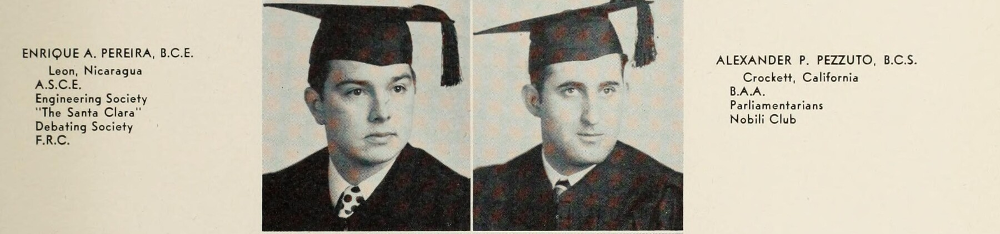

## Relationship And Research Note

Enrique A. Pereira de Nueda was the maternal grandfather of Robert Boscacci, the site owner: he was the father of Frances Lucia Pereira, who married Mark Boscacci.

This page was researched, drafted, and assembled by **OpenAI Codex**, a GPT-5-based coding agent, at extra-high effort. The work combined public web and archive research, yearbook image comparison, and careful historical inference. Treat it as sourced notes and leads, not as a certified civil registry file or completed family genealogy.

## Quick Read

Enrique A. Pereira de Nueda was a Nicaraguan civil engineer and builder with a documented Santa Clara education and a long public record around Managua construction.

The strongest public record says:

- **Name in U.S. college record:** [Enrique A. Pereira, B.C.E.](https://archive.org/details/redwoodunse_37), from Leon, Nicaragua.
- **Education:** Santa Clara civil engineering, class of 1948.
- **Company:** cofounder of [CONSOVIPE / SOVIPE](https://sajurin.enriquebolanos.org/docs/G-1956-04-30.pdf), tied to the names Solorzano, Villa, and Pereira.
- **Work:** Managua commercial, public, airport, power, and housing construction.
- **U.S. connection:** Santa Clara education, later U.S. exile/residence, and death in Miami.
- **Political/labor context:** described in later reporting as a pro-Somoza exile and as an antagonist of construction labor leader Domingo Sanchez.
- **Family leads:** secondary Nicaraguan genealogies point to Leon-rooted Pereira and Castellon lines, and to Daisy Solorzano's father as a former Nicaraguan consul general in New York.

This page separates firm source-backed facts from leads that still need primary family or archival confirmation.

## Santa Clara, 1948

The [1948 *Redwood* yearbook](https://archive.org/details/redwoodunse_37) at the University of Santa Clara identifies him as **Enrique A. Pereira, B.C.E.**, from **Leon, Nicaragua**. The listing includes A.S.C.E., Engineering Society, *The Santa Clara*, Debating Society, and F.R.C.

  <figure class="yearbook-context">
    
    <figcaption><strong>Enrique A. Pereira</strong> <a href="https://archive.org/details/redwoodunse_37">1948 <em>Redwood</em></a>, printed p. 51.</figcaption>
  </figure>

The degree abbreviation, the Engineering Society listing, and A.S.C.E. point directly toward civil engineering. That matches later Nicaraguan records describing him as an engineer.

## Builder In Nicaragua

A 2007 *Mercados & Tendencias* memorial profile, preserved at [Archive Today](https://archive.ph/fQ5L8), identifies him as **Enrique Pereira De Nueda**, born August 11, 1926 in Managua, and says he graduated as a civil engineer from Santa Clara University in 1948.

That profile says he cofounded **CONSOVIPE, Consorcio Sovipe (Solorzano, Villa, Pereira) de Ingenieros S.A.**, in 1950. It credits the firm with major Managua and national projects, including the Banco de America building, Fabritex, Seguro Social, First National City Bank, Las Mercedes International Airport, Tipitapa Power, Casa Presidencial, free-zone buildings, Las Brisas power-plant expansion, telecom towers, and more than ten thousand homes in urbanizations including Unidad de Propositos, Las Mercedes, Altamira D'Este, Planes de Altamira, Bosques de Altamira, and 14 de Septiembre.

The profile is secondary, but it lines up with official traces:

- [La Gaceta, April 30, 1956](https://sajurin.enriquebolanos.org/docs/G-1956-04-30.pdf), records **Solorzano, Villa, Pereira, Compania limitada**, acting through Enrique Pereira de Nueda, described as married and a civil engineer, in a land matter.
- [La Gaceta, September 21, 1998](https://sajurin.enriquebolanos.org/docs/G-1998-09-21.pdf), prints a shareholder notice for **SOVIPE, Ingenieros, S.A.**, with offices in Managua.
- [La Gaceta, October 21, 2002](https://sajurin.enriquebolanos.org/docs/Gaceta%20199-2002.pdf), preserves a 2000 Nicaraguan construction chamber record where **CONSOVIPE** is represented by **Ing. Enrique Pereira Denueda, Presidente de la Directiva**.
- A 1973 U.S. National Bureau of Standards / National Academy of Engineering report on [building performance in the 1972 Managua earthquake](https://www.govinfo.gov/content/pkg/GOVPUB-C13-3d029aabd3a2ed6543f9c31b989b9d84/pdf/GOVPUB-C13-3d029aabd3a2ed6543f9c31b989b9d84.pdf) lists **Sr. Enrique Pereira, Contractor** among the Nicaraguan contacts for the engineering team.
- [La Prensa, September 25, 2000](https://www.laprensani.com/2000/09/25/nacionales/783278-ex-socio-hondureo-de-consovipe-en-escndalo-habitacional), describes Enrique Pereira Denueda as founder and proprietor of Consovipe in the context of a Honduras housing-consortium dispute involving Enrique Pereira Solorzano.
- A separate [La Prensa interview from the same date](https://www.laprensani.com/2000/09/25/nacionales/783308-ganamos-porque-somos-los-mejores) gives the company's own retrospective project list through Enrique Pereira Solorzano: Las Mercedes, Unidad de Propositos, Las Americas, the Altamiras, Banco Central, Banco de America, Corte Suprema de Justicia, Tabacalera, and U.S. work in Miami and California after expropriation.
- A later [La Prensa history of the Casa Presidencial](https://www.laprensani.com/2021/11/05/politica/2903431-casa-presidencial-nicaragua-daniel-ortega-casa-de-los-pueblos) independently says SOVIPE built the Casa Presidencial and the Cancilleria in the late 1990s.

Taken together, the record shows a Santa Clara-trained civil engineer who became one of Nicaragua's better-known private builders.

## Politics And Labor

The public record also has political edges.

The *Mercados & Tendencias* memorial says that, because of his support for Anastasio Somoza, he went into exile in the United States from 1980 to 1990, where he worked as president and director of several construction companies. The same profile says CONSOVIPE resumed work in Nicaragua after his 1990 return.

[La Gaceta, September 6, 1982](https://sajurin.enriquebolanos.org/docs/G-1982-09-06.pdf), gives an official trace of that rupture: SOVIPE and Inversiones SOVIPE share certificates in the names of Julio Villa Arguello, Enrique Pereira Denueda, Arnoldo Robelo Pascua, and Ricardo Marin Rivera were cancelled and ordered reissued to the State under absence decrees.

A [La Prensa profile of Domingo Sanchez](https://www.laprensani.com/2016/03/09/politica/1999276-camarada-chaguitillo) frames Enrique Pereira de Nueda as "Tiburon Pereira," the business-side antagonist of Sanchez, a construction labor leader. The same article calls him a director-partner of SOVIPE and describes SOVIPE as the largest construction company in Nicaragua. It also says the nickname "Tiburon" dated to his first year at Colegio Centroamerica in 1938.

An [IHNCA exile-archive inventory](https://ihncaexilio.org/el-acervo-ihnca/libros/movimientos-sociales/) separately lists a 1976 control card for Ing. Enrique Pereira Denueda, owner/manager of SOVIPE, S.A., also known as "Tiburon Pereira." That is not the underlying card itself, but it is a useful breadcrumb for future archival work.

A [1965 *TIME* article](https://time.com/archive/6628554/the-alianza-three-on-the-go/) names a Nicaraguan businessman Enrique Pereira in construction and automobile parts as part of a rising management class during the Alliance for Progress period. That is a plausible contemporary press mention of the same man, but the age printed there does not perfectly reconcile with the 2007 memorial profile, so it remains a strong lead rather than a settled identity match.

## Family And Name Clues

Family context identifies him as the father of Frances Lucia Pereira and identifies his wife as **Daisy Solorzano**. A [1957 issue of *La Gaceta*](https://sajurin.enriquebolanos.org/docs/G-1957-11-19.pdf) prints the married-name form **Daisy Solorzano de Pereira** as secretary in a corporate notice. That supports the married-name trail, though the family relationship should still be paired with family documents if this page is later expanded into a full genealogy.

Two secondary genealogy compilations give a useful map, but these should be treated as leads until backed by civil or church records:

- The [Castellon genealogy](https://studylib.es/doc/6054631/castell%C3%B3n---apellidosnicas.net) identifies Enrique Pereira Denueda as a child of **Enrique Pereira Arguello**, born in Leon, Nicaragua, and **Tintina Denueda Zuniga**, daughter of Crescencio De Nueda and Luisa Zuniga. It also gives the paternal line as Enrique Pereira Arguello -> Tomas Pereira Castellon -> Dolores Castellon Vallecillo.
- The same genealogy names **Luis Pereira Denueda** and **Auxiliadora Pereira Denueda** as Enrique's siblings. That sibling relationship still needs primary proof, but an Ing. [Luis Pereira Denueda](https://www.leybook.com/doc/3021) appears in official records as general manager of Managua's water utility, and [another official text](https://nicaragua.justia.com/nacionales/reglamentos/reglamento-de-la-empresa-aguadora-de-managua-1-mar-13-1972/gdoc/) shows him signing as Minister of Public Works by law.
- The [Renazco genealogy](https://es.doczz.net/doc/3072733/la-familia-re%C3%B1azco-de-managua--nicaragua) identifies Daisy as **Daisy Solorzano Thompson**, daughter of **Ernesto Solorzano Diaz** and **Dora Thompson Gutierrez**. It gives Dora's parents as Thomas Thompson and Francisca Gutierrez Arcia.
- That Renazco line names Ernesto Solorzano Diaz's parents as **Jose Solorzano Aviles** and **Helena Diaz Recinos**, born in San Jose, Costa Rica. It also makes Ernesto a descendant of the Diaz-Renazco and Solorzano-Aviles lines, which helps explain why the Solorzano side surfaces in Nicaraguan political, press, and diplomatic records.

## The New York Consul Lead

The family memory about a consul general in New York appears to point to Daisy's father rather than to a Pereira.

The [January 1914 *Bulletin of the Pan American Union*](https://archive.org/details/sim_bulletin-of-the-pan-american-union_1914-01_38_1) congratulates **Don Ernesto Solorzano D.** on being appointed **consul general of Nicaragua in New York City**, with headquarters at **66 Beaver Street**. A [1915 Trow's New York directory](https://archive.org/details/trowsgeneraldire1915trow) repeats the consular listing and also lists **Ernesto Solorzano Diaz, consul-general of Nicaragua**, residing at **100 Cathedral Parkway**.

That is a strong match to the "consul general in New York" clue, and it fits the genealogy that makes Ernesto Solorzano Diaz Daisy's father.

I also found a separate Pereira consular breadcrumb: [La Gaceta, April 2, 1970](https://sajurin.enriquebolanos.org/docs/G-1970-04-02.pdf), names **Victor M. Pereira** and Ambassador Guillermo Lang as Nicaraguan observers to a United Nations / FAO meeting in New York. In that sentence, Guillermo Lang and Victor M. Pereira are described, respectively, as **consul general** and **vice consul** of Nicaragua in New York. So Victor M. Pereira may be the Pereira-shaped version of the memory, but the official wording makes him vice consul, not consul general, in that record. I did not find a link from Victor M. Pereira to either the Pereira Denueda or Solorzano Thompson lines in this pass.

## Daisy's Father

The Ernesto Solorzano Diaz trail is interesting on its own.

The [Tulane Adolfo Diaz Papers collection guide](https://www.scribd.com/document/20603709/Adolfo-Diaz-Papers-Latin-American-Library-Tulane-University) describes Ernesto Solorzano Diaz as former President Adolfo Diaz's nephew and representative in Nicaragua in La Luz / Siuna mining business correspondence. The [IHNCA Adolfo Diaz archive inventory](https://ihncaexilio.org/el-acervo-ihnca/colecciones-especiales/adolfo-diaz/) also has a payment-voucher entry in Ernesto's name and New York consular-expense material in the broader Diaz papers.

A [La Prensa anniversary history](https://www.enriquebolanos.org/media/archivo/50_Aniversario_-__La_Prensa_-_Parte_1_de_6_%281926-1935%29.pdf) says that in 1928 Ernesto Solorzano Diaz briefly bought interests in *La Prensa* before those shares were later bought by Pedro Belli and Adolfo Ortega Diaz.

A [1969 issue of *Revista Conservadora del Pensamiento Centroamericano*](https://sajurin.enriquebolanos.org/docs/RC_1969_07_N106.pdf), recounting the 1926 constitutionalist conflict, says Bluefields insurgents captured **Intendente don Ernesto Solorzano Diaz** on May 2, 1926. That places him in the Caribbean-coast political crisis around the fall of Carlos Solorzano and the return of Adolfo Diaz.

Those are not yet direct genealogical proof, but they put Daisy's father in the diplomatic, mining, press, and civil-war political circles of early twentieth-century Nicaragua.

## Name Variants

The sources vary slightly:

- Santa Clara: **Enrique A. Pereira**
- Nicaraguan records and press: **Enrique Pereira de Nueda**, **Enrique Pereira Denueda**, or **Enrique Pereira De Nueda**
- Nickname: **Tiburon Pereira**
- Place clue: Santa Clara lists Leon, Nicaragua; the memorial profile says he was born in Managua.

Those forms appear to refer to the same person because they share the Santa Clara civil-engineering date, Nicaragua/Managua career, SOVIPE/CONSOVIPE connection, and later press identity.

## What This Does Not Prove

This page does not yet prove the full legal name, exact immigration status, marriage record, complete project list, or complete political history. Those would need family papers, civil registry records, corporate filings, construction permits, newspaper archives, and the underlying IHNCA labor-file material.

## Best Next Records To Find

- **Santa Clara registrar or alumni file.** Confirm full name, degree, attendance dates, and any address or parent/guardian information.
- **Nicaraguan civil records.** Birth, marriage to Daisy Solorzano, and death or burial documents would lock down the family line.
- **Corporate filings for CONSOVIPE / SOVIPE.** The 1950 incorporation record and later changes would identify partners, officers, and company name changes.
- **Managua permits and project records.** Look for Banco de America, Fabritex, Seguro Social, Las Mercedes airport, Tipitapa Power, Casa Presidencial, and the housing developments named above.
- **IHNCA labor file.** The 1976 SOVIPE control card and labor documents around SOVIPE would help clarify the "Tiburon Pereira" labor-history context.
- **Civil or church records for the parent generation.** Verify Enrique Pereira Arguello, Tintina Denueda Zuniga, Ernesto Solorzano Diaz, and Dora Thompson Gutierrez from birth, marriage, baptism, or burial entries.
- **New York consular directories.** Check 1913-1916 U.S. foreign consular lists, New York directories, and Nicaraguan foreign-ministry records for Ernesto Solorzano Diaz and the 1970 Victor M. Pereira lead.
- **Miami exile-era records.** Business registrations, newspaper articles, and nonprofit filings from 1980-1990 could clarify his U.S. activities.

## Sources Checked

- [Internet Archive: 1948 *Redwood*](https://archive.org/details/redwoodunse_37)
- [Mercados & Tendencias memorial profile, archived copy](https://archive.ph/fQ5L8)
- [Genealogia de la Familia Castellon, secondary genealogy](https://studylib.es/doc/6054631/castell%C3%B3n---apellidosnicas.net)
- [La Familia Renazco de Managua, Nicaragua, secondary genealogy](https://es.doczz.net/doc/3072733/la-familia-re%C3%B1azco-de-managua--nicaragua)
- [Bulletin of the Pan American Union, January 1914](https://archive.org/details/sim_bulletin-of-the-pan-american-union_1914-01_38_1)
- [Trow's General Directory of Manhattan and Bronx, 1915](https://archive.org/details/trowsgeneraldire1915trow)
- [La Gaceta, April 30, 1956](https://sajurin.enriquebolanos.org/docs/G-1956-04-30.pdf)
- [La Gaceta, November 19, 1957](https://sajurin.enriquebolanos.org/docs/G-1957-11-19.pdf)
- [La Gaceta, April 2, 1970](https://sajurin.enriquebolanos.org/docs/G-1970-04-02.pdf)
- [La Gaceta, September 6, 1982](https://sajurin.enriquebolanos.org/docs/G-1982-09-06.pdf)
- [La Gaceta, September 21, 1998](https://sajurin.enriquebolanos.org/docs/G-1998-09-21.pdf)
- [La Gaceta, October 21, 2002](https://sajurin.enriquebolanos.org/docs/Gaceta%20199-2002.pdf)
- [Leybook: Empresa Aguadora de Managua loan authorization](https://www.leybook.com/doc/3021)
- [Justia Nicaragua: Reglamento de la Empresa Aguadora de Managua](https://nicaragua.justia.com/nacionales/reglamentos/reglamento-de-la-empresa-aguadora-de-managua-1-mar-13-1972/gdoc/)
- [NBS/NAE: Building Performance in the 1972 Managua Earthquake](https://www.govinfo.gov/content/pkg/GOVPUB-C13-3d029aabd3a2ed6543f9c31b989b9d84/pdf/GOVPUB-C13-3d029aabd3a2ed6543f9c31b989b9d84.pdf)
- [TIME: "The Alianza: Three on the Go"](https://time.com/archive/6628554/the-alianza-three-on-the-go/)
- [La Prensa: "Camarada Chaguitillo"](https://www.laprensani.com/2016/03/09/politica/1999276-camarada-chaguitillo)
- [La Prensa: Consovipe Honduras housing-consortium article](https://www.laprensani.com/2000/09/25/nacionales/783278-ex-socio-hondureo-de-consovipe-en-escndalo-habitacional)
- [La Prensa: "Ganamos porque somos los mejores"](https://www.laprensani.com/2000/09/25/nacionales/783308-ganamos-porque-somos-los-mejores)
- [La Prensa: Casa Presidencial history](https://www.laprensani.com/2021/11/05/politica/2903431-casa-presidencial-nicaragua-daniel-ortega-casa-de-los-pueblos)
- [La Prensa 50th anniversary historical PDF, 1926-1935](https://www.enriquebolanos.org/media/archivo/50_Aniversario_-__La_Prensa_-_Parte_1_de_6_%281926-1935%29.pdf)
- [Tulane Adolfo Diaz Papers collection guide, mirrored copy](https://www.scribd.com/document/20603709/Adolfo-Diaz-Papers-Latin-American-Library-Tulane-University)
- [IHNCA Adolfo Diaz archive inventory](https://ihncaexilio.org/el-acervo-ihnca/colecciones-especiales/adolfo-diaz/)
- [Revista Conservadora del Pensamiento Centroamericano, July 1969](https://sajurin.enriquebolanos.org/docs/RC_1969_07_N106.pdf)
- [IHNCA exile archive: Movimientos Sociales inventory](https://ihncaexilio.org/el-acervo-ihnca/libros/movimientos-sociales/)
