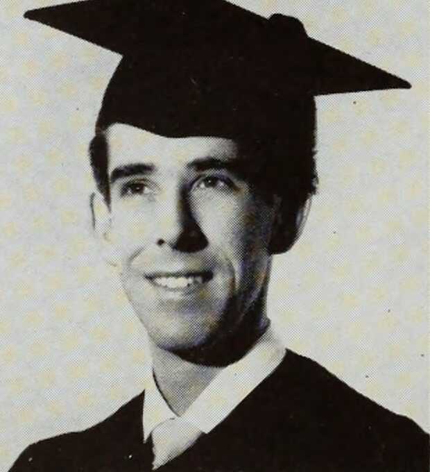
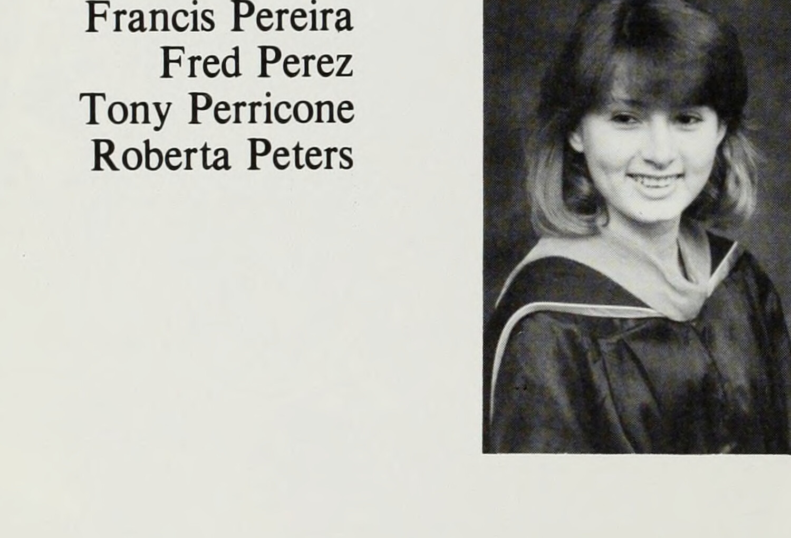



## Relationship And Research Note

Robert E. Boscacci was the paternal grandfather of Robert Boscacci, the site owner: he was Mark Boscacci's father.

This page was researched, drafted, and assembled by **OpenAI Codex**, a GPT-5-based coding agent, at extra-high effort. The work combined visual inspection of the family portrait, public web and archive research, yearbook image comparison, and careful historical inference. Treat it as sourced notes and leads, not as a certified military service record or completed family genealogy.

## Quick Read

This is a **World War II-era [U.S. Army Air Forces](https://web.archive.org/web/20250126182535/https://www.afhistory.af.mil/FAQs/Fact-Sheets/Article/459016/1907-1947-the-lineage-of-the-us-air-force/) officer portrait**. The sleeve patch, collar brass, and shoulder rank indicate a commissioned officer in the Army's wartime air arm, wearing the Army officer service uniform often nicknamed **[pinks and greens](https://www.nationalww2museum.org/war/articles/pinks-and-greens)**.

The most likely read is:

- **Service:** [U.S. Army Air Forces](https://web.archive.org/web/20250126182535/https://www.afhistory.af.mil/FAQs/Fact-Sheets/Article/459016/1907-1947-the-lineage-of-the-us-air-force/), with [Air Corps branch insignia](https://airandspace.si.edu/collection-objects/insignia-collar-officer-united-states-army-air-corps/nasm_A19710218000) still in use.
- **Rank:** lieutenant; probably **[second lieutenant](https://www.si.edu/object/insignia-rank-second-lieutenant-united-states-army-air-force%3Anasm_A19951099000)** if the single bar was gold.
- **Date window:** not earlier than **February 23, 1942**, when the [AAF shoulder patch](https://web.archive.org/web/20250125220851/https://www.afhistory.af.mil/FAQs/Fact-Sheets/Article/459018/army-air-forces-world-war-ii-shoulder-sleeve-insignia/) was approved; most likely **1942-1945**, with a possible immediate-postwar tail through **1947**.
- **Assignment clue:** the sleeve patch is the generic [AAF "Hap Arnold" winged-star emblem](https://web.archive.org/web/20250125220851/https://www.afhistory.af.mil/FAQs/Fact-Sheets/Article/459018/army-air-forces-world-war-ii-shoulder-sleeve-insignia/), not a numbered Air Force or theater-specific patch.
- **Unknowns:** the portrait alone does not identify his specialty.

## What Is Visible

**The sleeve patch is Army Air Forces.** The patch on his upper sleeve matches the [AAF shoulder sleeve insignia](https://web.archive.org/web/20250125220851/https://www.afhistory.af.mil/FAQs/Fact-Sheets/Article/459018/army-air-forces-world-war-ii-shoulder-sleeve-insignia/): a winged star on a dark circular field. The Air Force Historical Support Division says this design was approved on **February 23, 1942**, and was initially worn by AAF personnel wherever stationed. The same source gives the color version: ultramarine disk, white star with red center, and golden wings.

This makes the portrait very unlikely to be pre-1942. It also places him in the [Army Air Forces era](https://web.archive.org/web/20250126182535/https://www.afhistory.af.mil/FAQs/Fact-Sheets/Article/459016/1907-1947-the-lineage-of-the-us-air-force/) rather than the independent U.S. Air Force era, which began in 1947.

**The lapel brass says United States officer plus aviation branch.** The visible upper lapel has the block **U.S.** device. Below it, the lower lapel device appears to be the [Air Corps winged propeller](https://airandspace.si.edu/collection-objects/insignia-collar-officer-united-states-army-air-corps/nasm_A19710218000). The Smithsonian's National Air and Space Museum describes the officer Air Corps collar insignia as gold wings with a silver two-blade propeller, which matches the small winged shape visible here.

**The shoulder bar makes him a commissioned lieutenant.** There is one rank bar on the shoulder strap. A single bar means lieutenant, not captain or higher. In a black-and-white portrait the metal color is the hard part: a gold bar would be [second lieutenant](https://www.si.edu/object/insignia-rank-second-lieutenant-united-states-army-air-force%3Anasm_A19951099000), while a silver bar would be first lieutenant. This one photographs relatively dark, which leans toward **second lieutenant**, but I would keep "lieutenant, likely second lieutenant" until a color original, service record, or another photo confirms it.

**The coat is the Army officer service uniform.** The cut, lapels, shirt, tie, shoulder straps, and formal studio presentation fit the WWII Army officer winter service uniform, popularly called **[pinks and greens](https://www.nationalww2museum.org/war/articles/pinks-and-greens)**. The National WWII Museum describes that uniform as a dark olive-drab officer coat paired with lighter drab trousers, russet-brown shoes, and the officer styling that became iconic in wartime portraits.

## Careful Suppositions

Robert E. Boscacci had likely been commissioned into the Army's aviation establishment and sat for this portrait either during training, after commissioning, or during a stateside assignment.

The generic [AAF sleeve patch](https://web.archive.org/web/20250125220851/https://www.afhistory.af.mil/FAQs/Fact-Sheets/Article/459018/army-air-forces-world-war-ii-shoulder-sleeve-insignia/) is a limited assignment clue. In early 1942 it was broadly worn across the Army Air Forces. In 1943, distinctive patches were authorized for overseas and numbered air forces, while the winged-star emblem continued for Headquarters AAF and some other personnel not wearing a specific air-force patch. If this photo was taken after mid-1943 and the patch is on his current-assignment sleeve, it may point more toward a stateside, headquarters, training, or independent-command context than a numbered combat air force.

The portrait does **not** show a ribbon rack, campaign medals, overseas bars, or a qualification badge clearly enough to read. It also does not show the left breast area well enough to rule out pilot, navigator, bombardier, observer, or aircrew wings. So absence of visible wings here is not evidence that he was not aircrew.

## Records Found So Far

These public references are not military service papers, but they narrow the search. Treat the civil-index items as leads until they are matched against family documents or an official service record.

- **University of Santa Clara, 1949.** A [1949 *Redwood* yearbook listing](https://archive.org/details/redwoodunse_38) identifies Robert E. Boscacci, B.C.S., from Stockton, California. The same page lists student roles including Business Manager of *The Santa Clara*, Senior Class Treasurer, Sanctuary Society Treasurer, Sodality, B.A.A., and Alpha Phi Omega.
- **Santa Clara alumni record, 1982-83.** [Santa Clara University](https://www.scu.edu/alumni/about/board/council-of-past-presidents/) lists Robert E. Boscacci, class of 1949, as Alumni Association president for 1982-83.
- **Civil birth and death index lead.** A secondary public index points to Robert Everett Boscacci, born November 18, 1924 in Stockton, California, son of William T. Boscacci and Nell M. Hunting, and died March 16, 1990 while associated with a San Jose-area ZIP code. The same public-index search also shows another Robert E. Boscacci born in California in 1924, so this should remain a probable identity lead rather than a proved military fact. No Social Security numbers are reproduced here.
- **1930 census lead.** A genealogy-forum transcription of the [1930 U.S. census](https://www.archives.gov/research/census/1930/) places a five-year-old Robert E. Boscacci in Stockton in the household of William T. and Nellie M. Boscacci. This should be checked against the census image.

I did not find a public indexed Army Air Forces service record, flight-school listing, unit roster, award notice, or casualty record in this pass.

## What This Does Not Prove

The portrait does not identify a squadron, base, theater, aircraft type, job specialty, or overseas service; those details would need orders, discharge papers, campaign ribbons, overseas-service stripes, a numbered Air Force patch in another photo, letters, or family records.

## Best Next Records To Find

- **Official Military Personnel File.** Request the complete OMPF from the [National Archives/NPRC](https://www.archives.gov/veterans/military-service-records), not only a separation summary. Include Army Air Forces, probable officer status, approximate WWII service, the possible Stockton birth date, and any family-held service number. Because many Army and Air Force files from this period were damaged or destroyed in the 1973 NPRC fire, also ask for auxiliary reconstruction records if the main file is unavailable.
- **Separation document.** Look specifically for a WWII officer separation form, often **WD AGO Form 53-98**. This is the single document most likely to list rank, organization, dates, military occupational specialty, decorations, campaigns, and separation location.
- **Draft registration card.** If the Stockton identity is correct, he turned 18 in November 1942. His WWII draft card may give residence, next of kin, employer or school status, and a physical description.
- **County-recorded discharge.** Check San Joaquin County and Santa Clara County recorder archives. Many veterans recorded discharge papers locally after the war; [National Archives guidance](https://www.archives.gov/veterans/military-service-records) also points researchers to state or county sources as an alternate path.
- **Santa Clara University records.** Registrar, alumni, or archives files may show wartime interruption, veteran status, ROTC participation, or graduation details around the [1946-1949 return-to-campus period](https://www.e-yearbook.com/yearbooks/University_Santa_Clara_Redwood_Yearbook/1949/Page_28.html).
- **More photographs and letters.** The back of this portrait, a full-chest portrait, cap insignia, both sleeves, a ribbon rack, flight wings, orders, or letters naming a base would materially narrow the service-history search.

## Sources Checked

- [Archived Air Force Historical Support Division: Army Air Forces World War II Shoulder Sleeve Insignia](https://web.archive.org/web/20250125220851/https://www.afhistory.af.mil/FAQs/Fact-Sheets/Article/459018/army-air-forces-world-war-ii-shoulder-sleeve-insignia/)
- [Archived Air Force Historical Support Division: 1907-1947, The Lineage of the U.S. Air Force](https://web.archive.org/web/20250126182535/https://www.afhistory.af.mil/FAQs/Fact-Sheets/Article/459016/1907-1947-the-lineage-of-the-us-air-force/)
- [National WWII Museum: "Pinks and Greens"](https://www.nationalww2museum.org/war/articles/pinks-and-greens)
- [Smithsonian National Air and Space Museum: U.S. Army Air Corps officer collar insignia](https://airandspace.si.edu/collection-objects/insignia-collar-officer-united-states-army-air-corps/nasm_A19710218000)
- [Smithsonian: U.S. Army Air Force second lieutenant rank insignia](https://www.si.edu/object/insignia-rank-second-lieutenant-united-states-army-air-force%3Anasm_A19951099000)
- [Santa Clara University Scholar Commons: The Redwood collection](https://scholarcommons.scu.edu/redwood/)
- [Internet Archive: 1949 *Redwood*](https://archive.org/details/redwoodunse_38)
- [Internet Archive: 1981 *Redwood*](https://archive.org/details/redwood77unse)
- [University of Santa Clara 1949 Redwood yearbook page](https://www.e-yearbook.com/yearbooks/University_Santa_Clara_Redwood_Yearbook/1949/Page_28.html)
- [University of Santa Clara 1981 Redwood yearbook text and pages](https://www.e-yearbook.com/yearbooks/University_Santa_Clara_Redwood_Yearbook/1981/Page_1.html)
- [Santa Clara University Alumni Council of Past Presidents](https://www.scu.edu/alumni/about/board/council-of-past-presidents/)
- [Santa Clara County Genealogy transcription of the University of Santa Clara Senior Class of 1949](https://legacy.sfgenealogy.org/santaclara/schools/scusc49g.htm)
- [National Archives: 1930 Federal Population Census](https://www.archives.gov/research/census/1930/)
- [National Archives: Request Military Service Records](https://www.archives.gov/veterans/military-service-records)
- Secondary public name-index and census-transcription leads were checked but are treated as unconfirmed and not fully linked here because they surface Social Security fields or still need image-level verification.

## Yearbook Photographs

Robert E. Boscacci appears on printed page 24 of the [1949 *Redwood*](https://archive.org/details/redwoodunse_38). Frances Pereira appears in the [1981 *Redwood*](https://archive.org/details/redwood77unse). The 1981 portrait page prints her name as "Francis Pereira"; the senior index lists "Frances L. Pereira."

  <figure class="yearbook-context">
    
    <figcaption><strong>Robert E. Boscacci</strong> <a href="https://archive.org/details/redwoodunse_38">1949 <em>Redwood</em></a>, printed p. 24.</figcaption>
  </figure>
  <figure class="yearbook-context">
    
    <figcaption><strong>Frances Pereira (Solorzano)</strong> <a href="https://archive.org/details/redwood77unse">1981 <em>Redwood</em></a>, printed p. 346.</figcaption>
  </figure>

